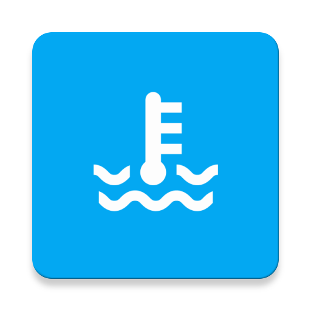

About
-------------

Temperature monitoring. Android app: https://github.com/fartem/android-remote-temperature-control-client.

Release configuration
-------------

Contains in `temperature_control` folder.

**Requirements**

- Android application;
- Arduino (tested on UNO (original and copy));
- power cable (using a standard cable);
- Bluetooth module (tested on HC-05 and HC-06);
- temperature and humidity sensor (tested on DHT22, now adopted only for this sensor series);
- resistor for temperature and humidity sensor;
- wires for connecting components.

Test configuration
-------------

Contains in `temperature_control_test` folder.

**Requirements**

- Android application;
- Arduino (tested on UNO (original and copy));
- power cable (using a standard cable);
- Bluetooth module (tested on HC-05 and HC-06);
- wires for connecting components.
